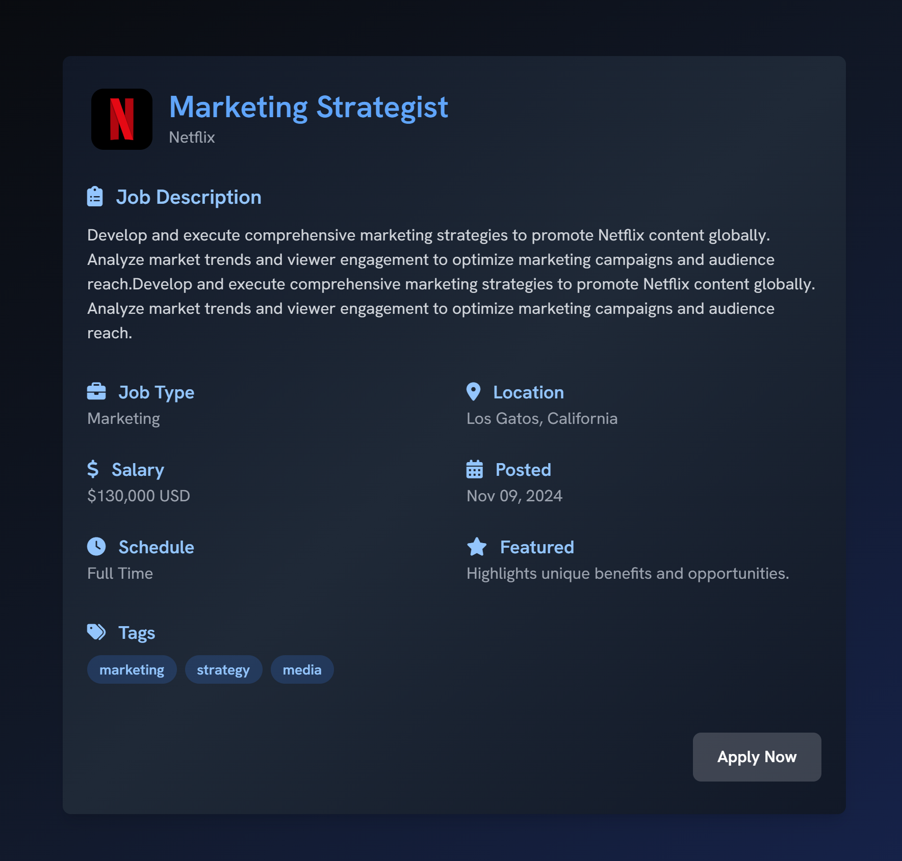
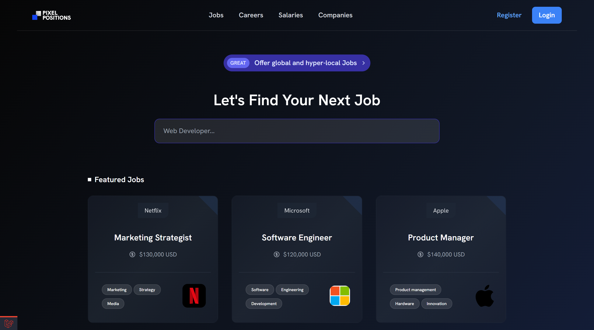
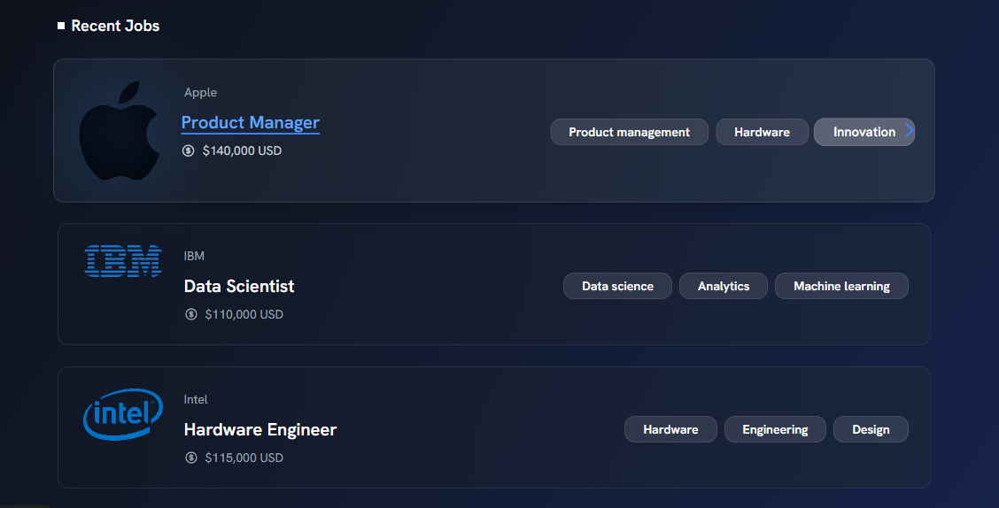
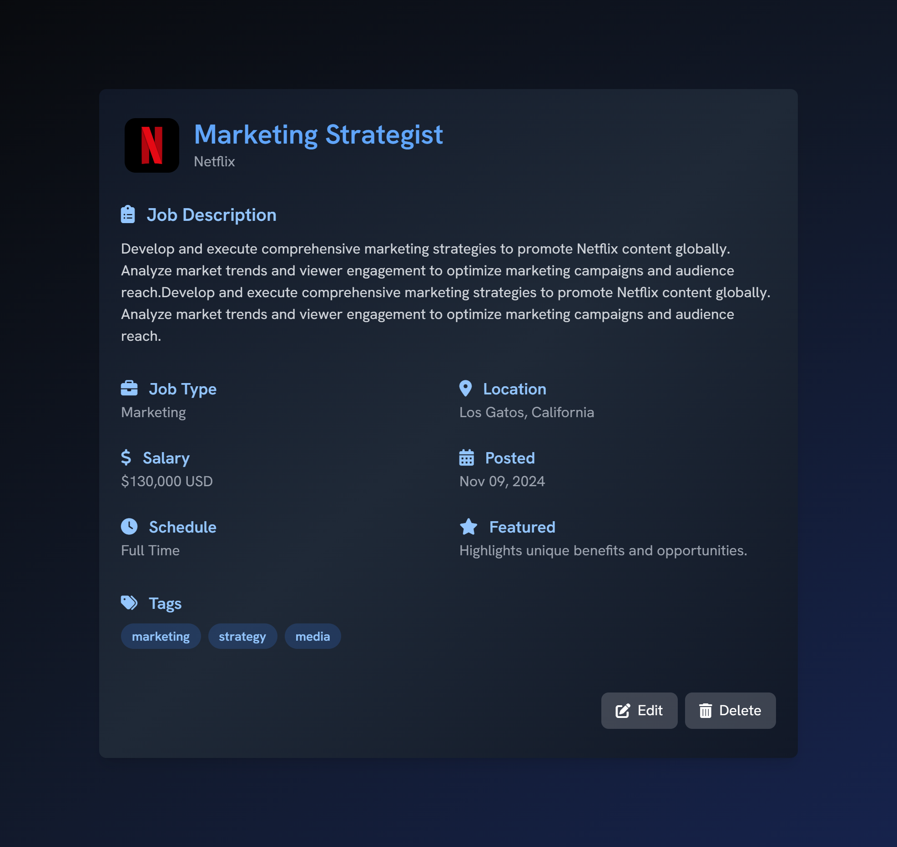
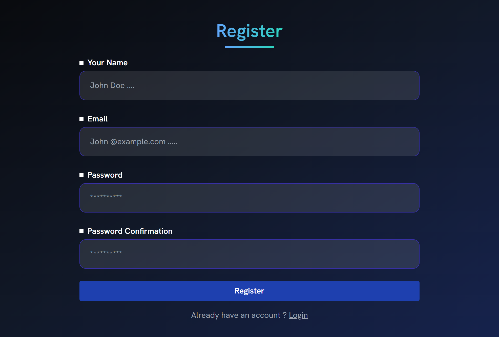

# 🔥 Pixel Positions - Your Job Finder 💼📊

## ✨ Overview

Welcome to **Pixel Positions** Job Application Site! An advanced Job Application platform built with **Laravel**. powered by modern front-end tools, and enhanced for optimal user experience. This platform streamlines the process of job posting, searching, and application management. Allows employers to post job openings and users to explore various job opportunities. Built with Laravel, this site offers a user-friendly interface and seamless user experience for job seekers and employers alike.

---

<div align="center">
   

<a href="https://packagist.org/packages/laravel/tinker"></a>
<a href="https://tailwindcss.com/"></a>
<a href="https://getcomposer.org/"></a>
<a href="https://github.com/ahmedalsanadi/Pixel-Job-App-Site.git/LICENSE"></a>

</p>

</div>

## 🎨 Features

-   **Job Listings** 📝: Employers can post job vacancies with comprehensive details like title, description, salary, and location.
-   **Tagging System** 🏷️: Tags categorize job listings by skills or industries, enabling easy filtering.
-   **User Authentication** 🔐: Role-based access for applicants and employers.
-   **Responsive Design** 📱: Fully responsive across devices for optimal user experience.
-   **Image and Logo Management** 🖼️: Upload, store, and manage company logos and cleanup on `migrate:fresh`.
-   **Search and Filter** 🔍: Powerful search and filter options for job seekers.

---

## 🛠️ Technologies Used

    | Dependency                | Description                | Version  |
    |---------------------------|----------------------------|----------|
    | Laravel                   | PHP framework              | ^11.9    |
    | Tailwind CSS              | Utility-first CSS framework| ^3.4.14  |
    | Font Awesome              | Icon library               | ^6.6.0   |
    | Axios                     | HTTP client for JS         | ^1.7.4   |
    | Composer                  | PHP dependency manager     | ^2.0     |
    | Vite                      | Front-end build tool       | ^5.0     |

---

## ⚙️ Setup and Installation

Follow these steps to set up the project locally:

1. **Clone the Repository**:

    ```bash
    git clone https://github.com/ahmedalsanadi/Pixel-Job-App-Site.git
    cd Pixel-Job-App-Site
    ```

2. **Install Dependencies**:

    - Composer
        ```bash
        composer install
        ```
    - npm
        ```bash
        npm install
        ```

3. **Environment Configuration**:

    - Copy `.env.example` to `.env` and configure your database:

        ```bash
        cp .env.example .env
        ```

    - Generate a key:

        ```bash
        php artisan key:generate
        ```

4. **Database Setup**:

    - Run migrations with seeders:

        ```bash
        php artisan migrate:fresh --seed
        ```

5. **Serve the Application**:

    - Development:

        ```bash
        npm run dev
        php artisan serve
        ```

    - Production:

        ```bash
        npm run build
        ```

---

## 📂 Folder Structure

-   **app/Models**: Contains Eloquent models like `User`, `Employer`, `Job`, and `Tag`.
-   **app/Http/Controllers**: Application controllers handling the app logic.
-   **database/migrations**: Database structure definition files.
-   **database/factories**: Factory files to generate dummy data.
-   **public/**: Public assets, including uploaded company logos.

---

## 🔗 Models and Relationships

1. **User** ↔️ **Employer**: One-to-One relationship.
2. **Employer** ↔️ **Job**: One-to-Many relationship.
3. **Job** ↔️ **Tag**: Many-to-Many relationship.

Each relationship is defined within the models, creating a robust and scalable data structure.

---

## 🚀 Factories and Seeding

This project includes several factories and seeders to quickly populate the database for testing:

-   **EmployerFactory**: Generates employers with logo uploads.
-   **JobSeeder**: Populates job listings linked with employers and tags.
-   **TagSeeder**: Creates skill-related tags for jobs.

To seed the database:

```bash
php artisan db:seed
```

---

## 🌟 How to Use

1. **Employers**:

    - Register or log in.
    - Post a job listing with all necessary details.
    - Add tags for easy filtering and skills search.

2. **Job Seekers**:
    - Browse jobs, or filter by location, tags, or keywords.
    - View job details and follow application instructions.

---

## 📸 Screenshots

## Hero Section

<p align="center">
  
</p>

<p align="center">
  
</p>

## Job Details

<p align="center">
  
</p>

## Register

<p align="center">
  
</p>

---

## 🤝 Contributing

Want to improve this project? Contributions are always welcome!

1. **Fork** the repository.
2. **Create** a new feature branch (`git checkout -b feature/AmazingFeature`).
3. **Commit** your changes (`git commit -m 'Add AmazingFeature'`).
4. **Push** to the branch (`git push origin feature/AmazingFeature`).
5. **Open** a Pull Request.

---

## 📜 License

This project is licensed under the MIT License - see the [LICENSE](./LICENSE) file for details.

---

Thank you for exploring the Job Application Site! We hope it provides a valuable resource.

<div align="center">
  Made with ❤️ by [Ahmed Al-Sanadi]
  
  ⭐ Star this repo if you find it helpful!
</div>

---
